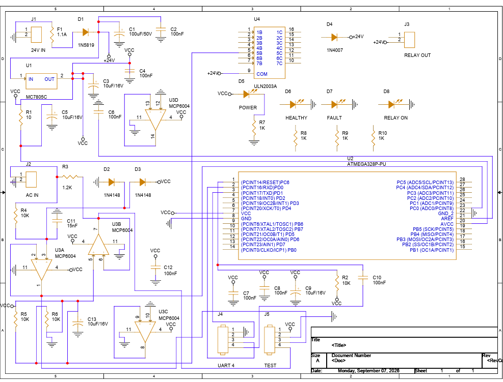
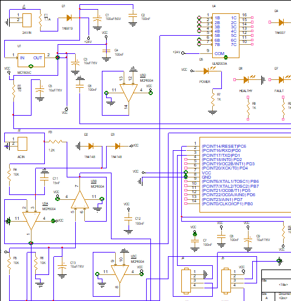

# PDP AC Voltage Monitoring & Protection PCB

A 2-layer control board for a Power Distribution Panel. It monitors 230 V AC line voltage through an external isolating transformer, detects over- and undervoltage conditions with a hardware comparator network, and trips an external 24 V contactor through a relay driver stage.

Designed end-to-end in OrCAD X Professional Plus — schematic capture through fabrication-ready manufacturing outputs. **Design-only project; not fabricated or assembled.**



*Full schematic - [PDF version](docs/schematic.pdf)*



*PCB layout, 100 x 80 mm, 2 layers*

---

## Design intent

Power distribution panels need to disconnect downstream load when supply voltage drifts outside a safe band. This board is the sensing and decision element of that loop: it watches the line, decides, and signals. It does not switch load current itself — that stays with an external contactor sized for the application.

A deliberate constraint shaped the whole design: **no mains-referenced copper on the PCB**. Line voltage is stepped down and isolated by an external transformer before it ever reaches the board, so every net on the PCB stays within SELV limits. This keeps creepage and clearance qualification off the board entirely and confines the hazardous-voltage boundary to a component the design does not own.

---

## Board specification

| | |
|---|---|
| Dimensions | 100 × 80 mm |
| Layers | 2 (signal top, ground pour bottom) |
| Components | 41 |
| Nets | 17 |
| Supply rails | 24 V field supply, 5 V logic |
| Voltage class | SELV throughout |
| Design tool | OrCAD X Capture 23.1 / Allegro 24.1 |

---

## Architecture

**Input and isolation** — Line voltage arrives at J2 (AC IN) from an external step-down transformer. R3 limits current into a 1N4148 clamp pair (D2/D3) forming a half-wave rectifier with overvoltage protection on the sense node.

**Scaling and filtering** — A resistor divider scales the rectified signal into the op-amp input range, with C11 (15 nF) providing low-pass filtering to reject switching noise and ripple.

**Detection** — An MCP6004 quad op-amp implements the over/undervoltage window comparison. Comparator outputs drive digital inputs on the ATmega328P rather than analog channels, so the protection decision is made in analog hardware and does not depend on firmware executing correctly. The MCU reads discrete fault flags and handles sequencing and indication.

**Output stage** — A ULN2003A Darlington array drives the external relay coil from the 24 V rail. D4 (1N4007) provides flyback clamping on the inductive load. J3 (RELAY OUT) carries the contactor connection.

**Power** — An MC7805C linear regulator derives the 5 V logic rail from the 24 V field supply, with bulk and decoupling capacitance at input, output, and per-IC.

**Indication and access** — Four LEDs (POWER, HEALTHY, FAULT, RELAY ON) give panel-visible status. J4 breaks out UART for programming and diagnostics; J5 is a test header.

---

## Layout

Routing was completed to **100% autoroute** — 79 connections, 93 wires, 6 vias, zero unconnections and zero conflicts.

Trace widths were constrained by function rather than applied uniformly: the 24 V rail and ground run at **0.5 mm** to handle relay coil current and minimise IR drop, while signal nets run at **0.13 mm**. A dynamic copper ground pour covers the bottom layer, giving a low-impedance return path and reducing loop area for the analog sense chain.

Final DRC: **0 errors, 0 shorting errors.**

---

## Manufacturing outputs

Complete fabrication package generated and included in `manufacturing/`:

- **Gerbers** — 11 films in RS-274X format, mm units, 2:5 precision: top and bottom copper, soldermask, silkscreen, solder paste, assembly drawings, and drill legend
- **NC drill** — Enhanced Excellon, 3:5 format, 145 holes across 5 tool sizes (0.33 / 0.86 / 0.91 / 1.07 / 1.37 mm)
- **BOM** — per-designator bill of materials with footprint mapping

---

## Repository structure

```
├── docs/                    Layout and schematic images
├── manufacturing/
│   ├── gerbers/             11 RS-274X films
│   ├── *.drl                Excellon drill file
│   └── bom.csv              Bill of materials
└── source/
    ├── *.DSN                OrCAD Capture schematic
    ├── *.brd                Allegro board file
    └── lib/                 Footprints and symbol library
```

---

## Scope and rev 2

Rev 1 covers the **voltage channel only**. The following are deliberately out of scope:

**Current sensing** — The original concept included overcurrent protection via a 300/5 A current transformer. This was cut to keep rev 1 deliverable within schedule; the CT interface and burden resistor network are rev 2 work.

**Threshold calibration** — Comparator reference dividers are populated with nominal equal-value resistors. Setting distinct over- and undervoltage trip points requires characterising the transformer's actual turns ratio and rectifier scaling, then selecting divider values against measured response. Not performed in a design-only project with no hardware to measure.

**Standards qualification** — Isolation is enforced architecturally by keeping mains off-board. Formal spacing qualification against IEC 61010 / IEC 60947 would be required before any deployment, along with the transformer's own certification.

**3D models** — Footprints render as bounding-box outlines; STEP models are not attached to most parts.

---

## Tools

OrCAD X Professional Plus — Capture 23.1 (schematic), Allegro 24.1 (layout, autoroute, manufacturing output).

---

**Janmesh Singh Bali** — B.E. Electronics, Instrumentation & Control Engineering, Thapar Institute of Engineering and Technology

